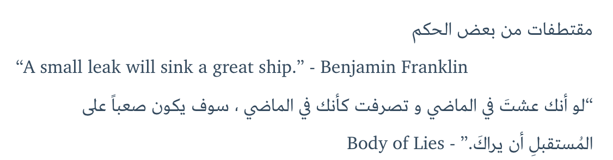

# hexo-tag-rtl

Force RTL layout direction when used in a mixed RTL and LTR texts.

# About
> This is a [Hexo](http://hexo.io/) tag plugin for changing the direction of your writing (layout)

## Installation
```bash
npm install --save hexo-tag-rtl
```

## Usage

```bash

  RTL text
 
```
## Example

An English document, but wants to have and RTL direction

```
مقتطفات من بعض الحكم


مقتطفات من بعض الحكم


“A small leak will sink a great ship.” - Benjamin Franklin


"لو أنك عشتَ في الماضي و تصرفت كأنك في الماضي ، سوف يكون صعباً على المُستقبلِ أن يراكَ." - Body of Lies


```

which results in



## Authors

[blueMix](bluemix.me)